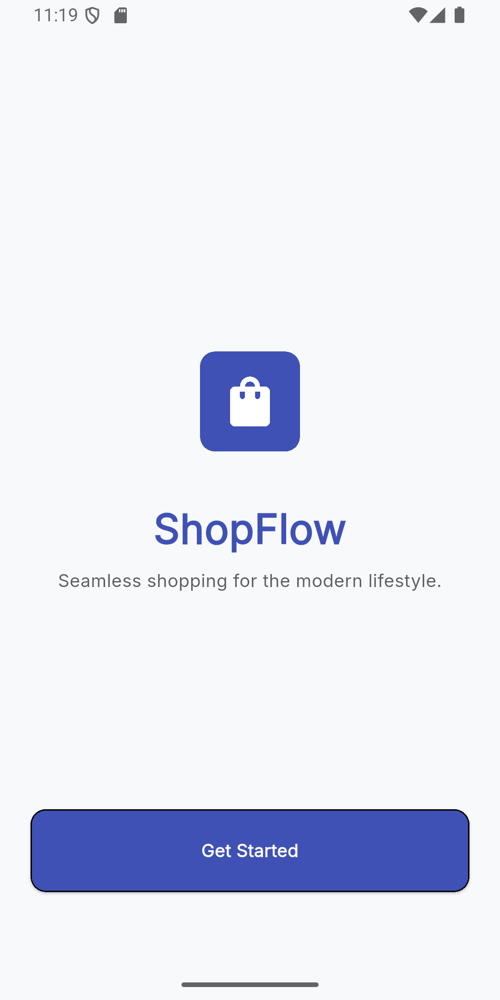
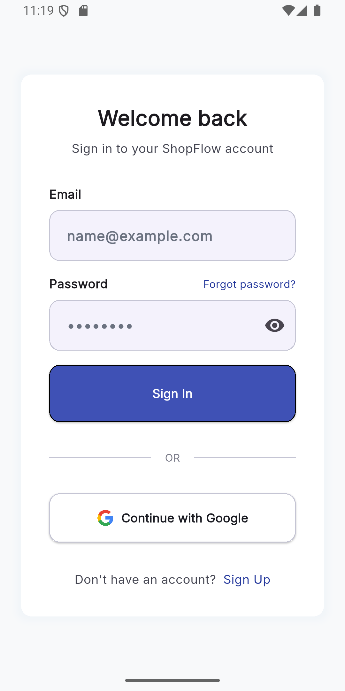
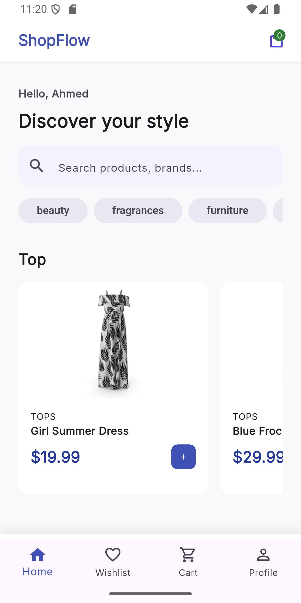
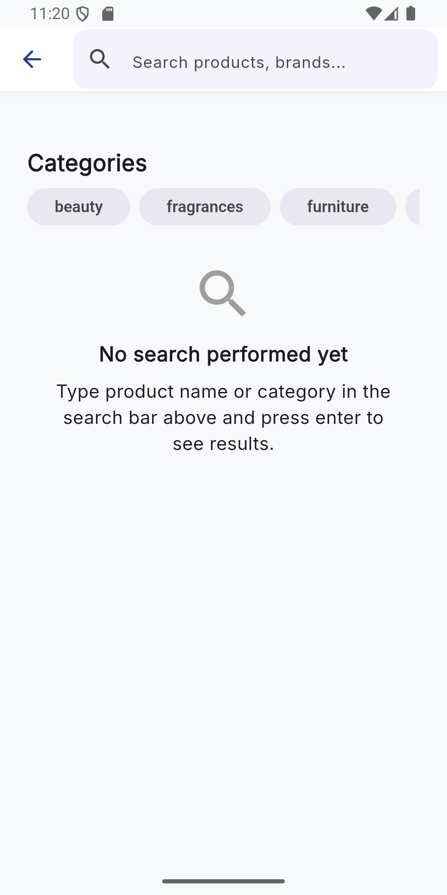
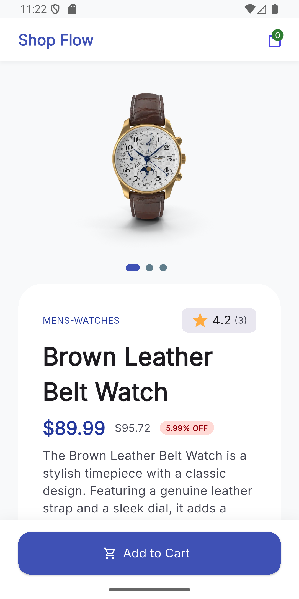
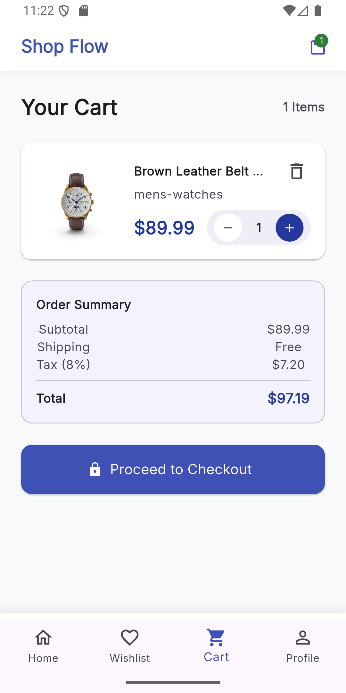
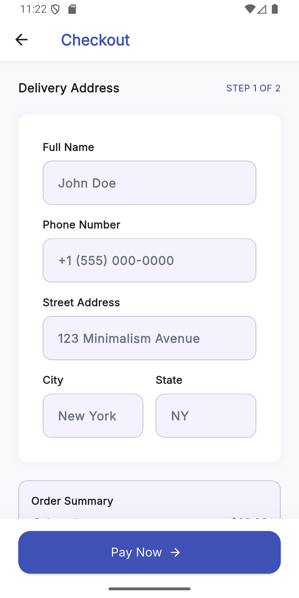
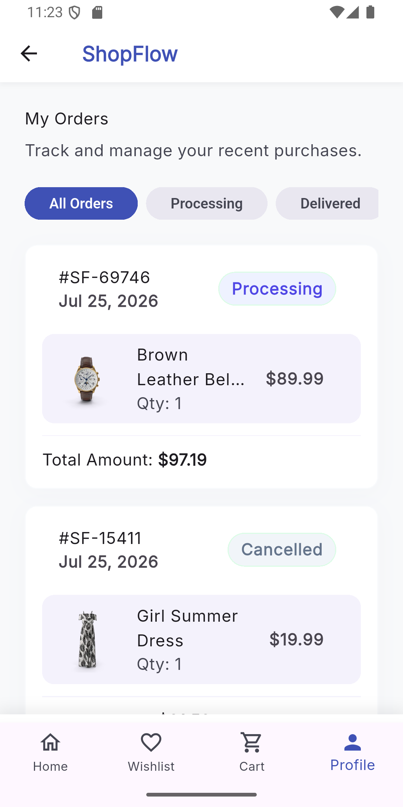
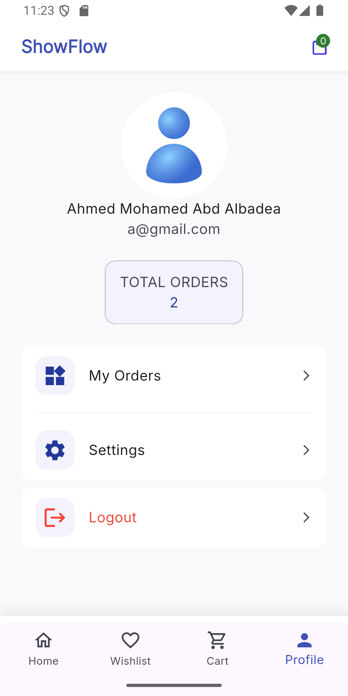

# 🛍️ Shop Flow

A modern Flutter e-commerce application built with **MVVM Architecture**, featuring Firebase Authentication, Cloud Firestore, Hive local storage, and Bloc state management.

## 🎥 Demo
🎬 Full demo available on LinkedIn:
[https://www.linkedin.com/posts/your-post-link](https://www.linkedin.com/posts/ahmed-abd-al-badea-3357092b2_flutter-dart-firebase-ugcPost-7486690772751167488-dniL/)
---

## ✨ Features

- User Authentication
- Browse Products
- Product Search
- Wishlist
- Shopping Cart
- Checkout
- Order History
- Google Sign-In
- Local Cart Storage using Hive
- Real-time Order Tracking

---

## 🛠️ Tech Stack

- Flutter
- Dart
- MVVM Architecture
- Bloc / Cubit
- Provider
- GetIt (Dependency Injection)
- Firebase Authentication
- Cloud Firestore
- Hive
- Dio
- GoRouter

---

## 📂 Project Structure

```text
lib
│
├── core
│   ├── errors
│   ├── helpers
│   ├── manager
│   ├── models
│   ├── utils
│   └── widgets
│
├── features
│   ├── auth
│   ├── cart
│   ├── home
│   ├── orders
│   ├── profile
│   ├── splash
│   └── wishlist
│
├── generated
├── l10n
│
├── constants.dart
├── firebase_options.dart
├── simple_bloc_observer.dart
└── main.dart
```

### Feature Structure

Each feature follows a modular MVVM structure.

```text
feature
│
├── data
│   ├── models
│   ├── remote_data_source
│   └── repository
│
├── manager
│   └── cubit
│
└── view
    ├── widgets
    └── screens
```

---


## 🚀 Getting Started

```bash
git clone https://github.com/ahmedabdalbadea/shop-flow.git

flutter pub get

flutter run
```

---

## 📸 Screenshots

<p align="center">
  
  
  
</p>

<p align="center">
  
  
  
</p>

<p align="center">
  
  
  
</p>
---

## 👨‍💻 Author

Ahmed Abd Albadea

LinkedIn:
http://www.linkedin.com/in/ahmed-abd-al-badea-3357092b2
